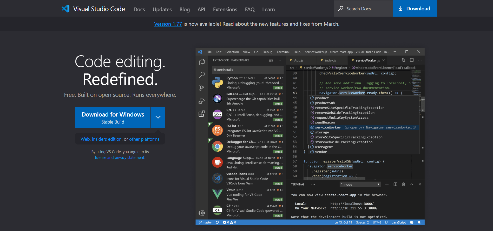
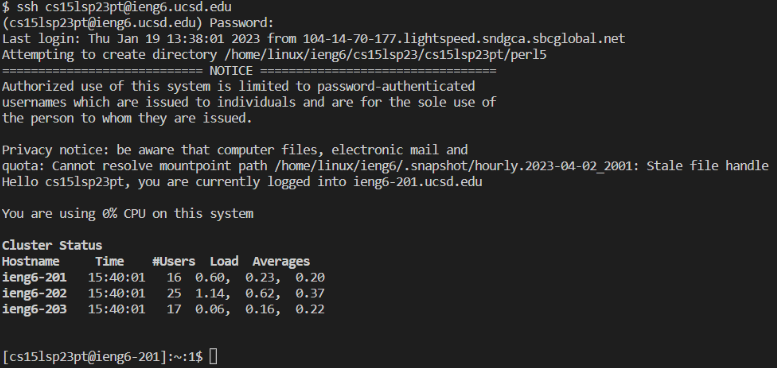
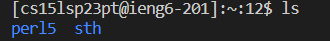
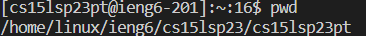

# **Tutorial to Log in CSE15L Course Specified Account**

CSE15L is a interesting course for you to explore computer science. Here, the first step is to log in and connect remotely to the server with `ssh` command.
Here are several steps you may need:
1. Download Visual Studio Code
2. Use `ssh` to connect to the server remotely
3. Trying some commends on the terminal
## Download Visual Studio Code
Firstly, go to the webside home page of Visual Studio Code, as the following figure:

You may choose to download Visual Studio Code according to the hardware setting (system) of your laptop or PC, and you may install the application with default settings provided with the installer exe.
Now, you already finished 1/3 of the this tutorial! We will look at how to remotely connect with the server in the following part.
## Remotely Connecting
To connect to the server remotely, you may fistly use *Ctrl* + ` to call the terminal interface.

Before continuing to use `ssh` command, it is necessary to set your passward for your course specifically account. This account starts with `cs15l` and is following with the quarter you are attending this course, the year, and two letters which are differet for every student. You may use UCSD Passward Change Tool to reset your passward.
Once you successfully reset your passward, it's time to back to the terminal of Visual Studio Code. You can download **git** required latter with [git for Windows](https://gitforwindows.org/).

You may see on the corner of this terminal window, there is a button showing "Powershell". Change it to "bush", and type in `$ ssh cs15lsp23zz@ieng6.ucsd.edu` replaced with your account here. Then, type in your passward and hit "Enter". If you see the similar thing with the following picture, you are successfully loggin in!

## Several Useful Commands
Now, let's see some basic commands that can be used to this git bash terminal.

* `ls`: check all files and directories in current working directory with this command.

  
  
* `pwd`: check the path of current working directory.

  

* `mkdir`: make a new directory.
* `cd`: change current working directory to a certain directory.
* `cd ..`: change to the parent directory of current working directory.
* `cd ~`: change to the home directory.
* `cat`: show the content of a specific file.

Congratulations! You completed this tutorial! Now try different combinations of these useful commands by yourself, and have fun!
