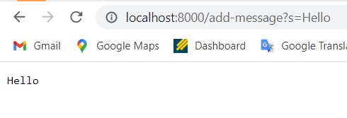
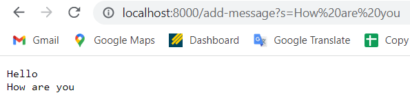

# **Servers and Bugs**
*Part 1*

String Server Function Code

```
public String handleRequest(URI url) {
    if (url.getPath().contains("/add-message")) {
        String parameters = url.getQuery();
        String query = parameters.split("=")[1];
        content.add(query);
    }
    return String.join("\n", content) + "\n";
}
```

Image 1:



In this image, a word "Hello" is added, which called the function of `handleRequest()`. The argument for this function is the url, `localhost:8000/add-message?s=Hello`. For this argument, the function initiated a new variable called "parameters" to store the query part of this url, and the eventually get the value of the content to add, which is after the "=", "Hello" specifically.


Image 2:



In this image, a string "How are you" is added. The same function as the last image is called, which is `handleRequest()`. The argument is still the url, but the value of content to add is changed to "How are you". Nevertheless, the function reacted as the last image and added this string to the content list.


*Part 2*

* Inputs that does not induce failure:

```
import static org.junit.Assert.*;
import org.junit.*;

public class ArrayTests {
	@Test 
	public void testReverseInPlace() {
    int[] input1 = { 3 };
    ArrayExamples.reverseInPlace(input1);
    assertArrayEquals(new int[]{ 3 }, input1);
	}


  @Test
  public void testReversed() {
    int[] input1 = { };
    assertArrayEquals(new int[]{ }, ArrayExamples.reversed(input1));
  }
}
```

* Failure-inducing inputs:

```
import static org.junit.Assert.*;
import org.junit.*;

public class ArrayTests {
	@Test 
	public void testReverseInPlace() {
    int[] input1 = { 3, 4, 5 };
    ArrayExamples.reverseInPlace(input1);
    assertArrayEquals(new int[]{ 3 }, input1);
	}


  @Test
  public void testReversed() {
    int[] input1 = { 1, 5, 9 };
    assertArrayEquals(new int[]{ }, ArrayExamples.reversed(input1));
  }
}
```

* Symptom and output:

    The two functions outputs the same arrays as the input arrays. For example, for the failure-inducint inputs, the two functions output { 3, 4, 5 } and { 1, 5, 9 }, in which the functions did not work effectively.

* The bugs and solutions:

    The buggy outputs is caused by the wrong loops in the for loops for both functions. The original functions are:
    
    ```
      static void reverseInPlace(int[] arr) {
         for(int i = 0; i < arr.length; i += 1) {
             arr[i] = arr[arr.length - i - 1];
         }
     }

      static int[] reversed(int[] arr) {
          int[] newArray = new int[arr.length];
          for(int i = 0; i < arr.length; i += 1) {
             arr[i] = newArray[arr.length - i - 1];
          }
          return arr;
      }
    ```
    
    To fix the bugs, the length in the for loops should not be `arr.length`. Instead, it should be `arr.length / 2`:
    
    ```
      static void reverseInPlace(int[] arr) {
         for(int i = 0; i < arr.length / 2; i += 1) {
             arr[i] = arr[arr.length - i - 1];
         }
     }

      static int[] reversed(int[] arr) {
          int[] newArray = new int[arr.length];
          for(int i = 0; i < arr.length / 2; i += 1) {
             arr[i] = newArray[arr.length - i - 1];
          }
          return arr;
      }
    ```
    
*part 3*

In lab 3, I learned how to compose and start an interactive website server that reacts with different url fields elements. This reveals the different compositions and applications of website urls in the real world.
