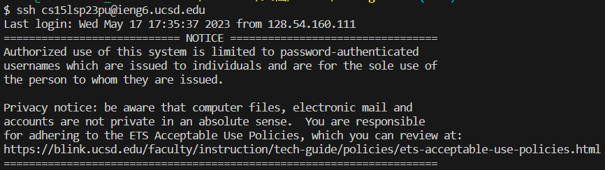
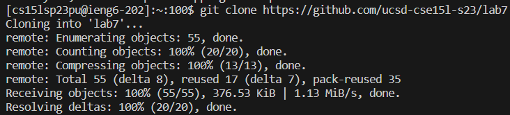

# **Lab Report 4**

Key steps to fix the bug with only using commands and the command window in bash script:

* Log into ieng6

  To do this step, we should type in the ieng6 accound by using `ssh` command as it in the figure below:
  
  
  
* Clone the fork or the the repository from github

  By using `git clone` command, we can clone a copy of the target repository to the ieng6 account. I used `git clone https://github.com/ucsd-cse15l-s23/lab7` to clone the repository:
  
  
  
  To check the copy repository, `ls` might be helpful:
  
  

* Run the test

  To run the junit test, the first thing to do is to change the current working directory to the copy repository, where I typed `cd lab7` and pressed `<Enter>`to change the working directory.
  
  

  To run the junit test, I typed `bash test.sh` and pressed `<Enter>`:
 
  

  The junit test reported failures, which says "timed out". The reason might be there are some infinite loops in the program.
  
* Edit the code file to fix the failing test

  To fix the bugs, let's look at the codes of the program. Type `vim ListExamples.java` and press `<Enter>` to use `vim` to check the original code.
  
  

  It should be something like below:
  
  

  Then, hold `h` and `k` until the cursor is at the top left corner of the file, which is important to make sure the searching steps next shows correct answer. Type `/index1` and `<Enter>` to search all the places where the variable `index1` appears, and press `n` 9 times to locate the target variable where the bug is at.
  
  

  Press `<esc>` to quit to the normal mode, then press `l` 11 times to move the cursor to the `1` of `index1`:
  
  

  After that, press `x` to delete the `1` and press `i` to use the insert mode. While in the insert mode, type `2` to make the variable change to `index2`. Press `<esc>` to return to the normal mode.
  
  

  When finishing fixing the bug and returing to the normal mode, type `:wq` and press `<Enter>` to save and exit this file. 
  
  

* Run the test again

  Here, type in `bash test.sh` (and press `<Enter>`) again to run the junit test.
  
  

  The test is passed now, which means the bug is fixed.
  
* Commit and Push

  Before commiting and pushing the file to the github account, use `git status` to check the changed file first:
  
  

  The file `ListExamples.java` is modified, but it is not added to commit. use `git add ListExamples.java` to add the file to commit. Then use `git status` to check again, the file changed to green, which means it is successfully added to commit:
  
  

  Then, type `git commit` and put some commit message (press `i` to insert) to commit the change:
  
  

  Press `:wq` to save the commit message.
  
  Last but not least, use `git push` and press `<Enter>` to push the fixed repository to the github account:
  
  

  
